# Matlab Note

#### Defined Variable
	Defined a variable and assign a value:
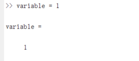
	
	And work place will show what a variable you create:

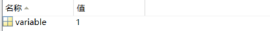

	Defined a variable and u dont assign, it will report bug:

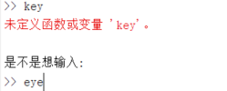

	Look for variable type:

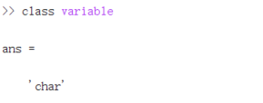

	Basic variable type:

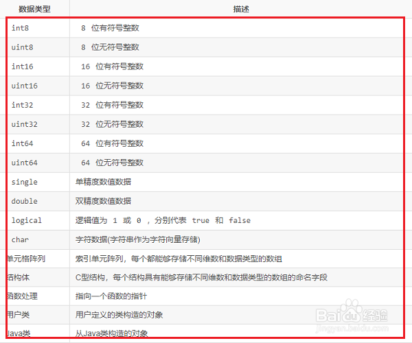

#### Calculation
	x = (5 * 2 + 1.3 - 0.8) * 10 ^ 2 / 25 calculate x:

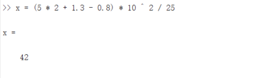

	Dont assign a variable and calculate:

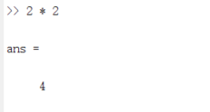

#### Command line
	clear, clc: (clean the variable)
	mkdir: create a folder
	ls,dir: get the files list of current directory

#### Create file
	Press Ctrl + s can save the file, it is same like sumlime editor.
	Run file, enter to the work directory and type the file name, then it will run.

#### Comment
	The comment line must start with %

#### Functions
	Defined a demo function(the funtion name must same as file name):
	The MyResult is return value, the RawNumber is parameter.
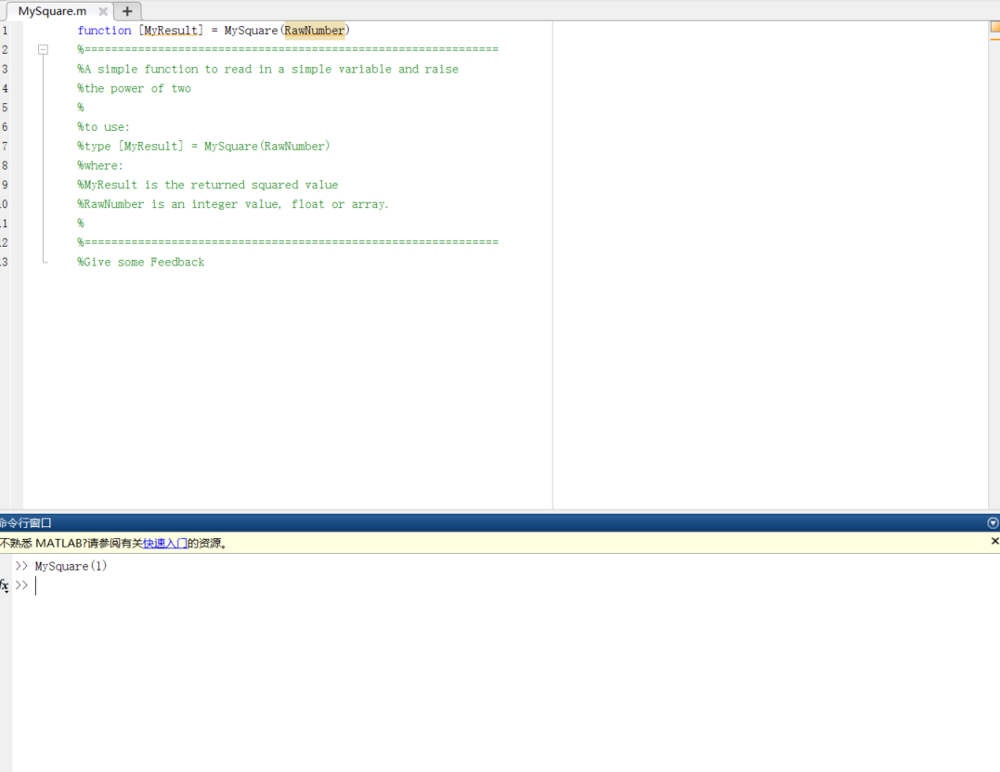

	Get function help documentation:
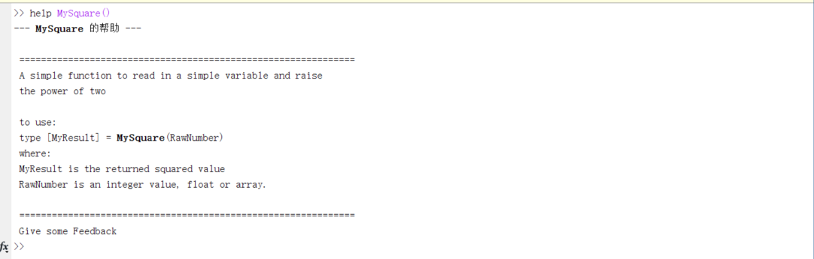

#### IO
	 Reading and writing .txt
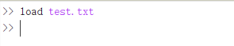

	 Output(combind .txt):
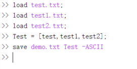

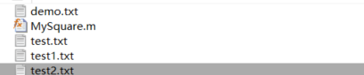

#### Plotting and Visualising
	Create a Simple Figure:

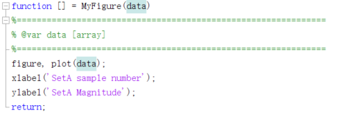

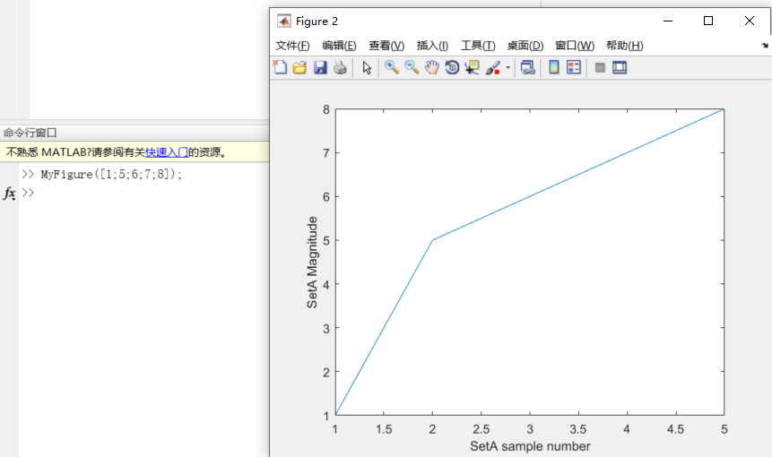

	Create a mutiple Figure:
	the subplot(param1, param2, param3)
	@var param1 [int] row numbers
	@var param2 [int] column numbers
	@var param3 [int] this is the figure's number

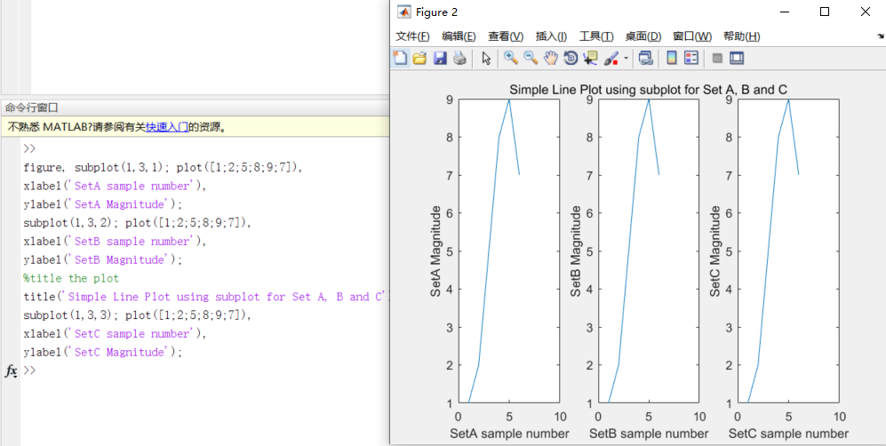