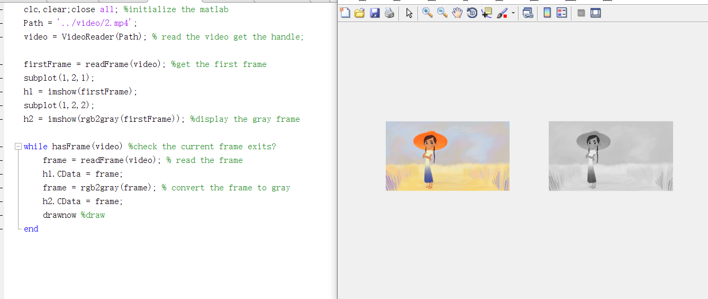

### TASK 1: Exposure. Use an .m file in Matlab to create a code that reads in a video file and then, frame by frame, multiply each pixel’s intensity by a scalar value of your choice


### TASK 2: Brightness. Use an .m file in Matlab to create a code that reads in a video file and then, frame by frame, adds to each pixel’s a predefined amount (i.e. see example with +125 below)


### TASK 3: Now display a third video stream in a new column to the right of the current display, displaying the subtraction of a predefined value to each pixel (i.e. -125).


### TASK 4: Following a similar approach as in Task 2 and 3, display the 3 colour intensity channels (R, G, B) side by side on separate video streams. See picture below for further reference.


### TASK 5 Saturation. Change the saturation value of the video ’xylophone.mp4’. A pseudo code is provided below.


### TASK I1: Create a function that returns the average intensity from all pixels in a frame. Plot the values.


### TASK I2: Use the function in TASK I1 to display (side by side) the frame with the highest and the lowest intensity.


### TASK I3: Contrast. Using the function created in TASK I1; create an m file that changes the contrast of a video. A pseudo code is provided below.


### TASK I4: Convert ’Xylophone.mp4’ video to grayscale.



### TASK I5: Using the Matlab tool VideoWriter, export the grayscale frames from TaskI4 to a new video file.


### TASK I6: Convert guided tasks (1-5) to functions. These functions will receive 2 input parameters: the video file-name and the scalar to add/multiply/subtract'
```
all the tasks are function.
```