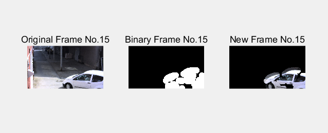
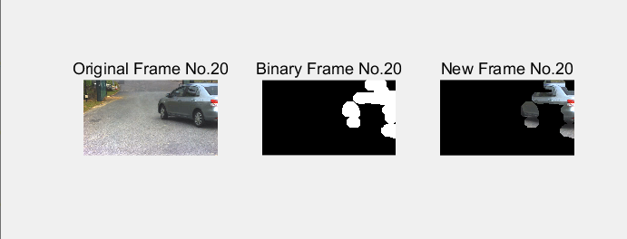

# Frame Differencing

### TASK 1: Frame Differencing. Download the ’cars.mp4’ video from Moodle. Use an .m file in Matlab to create a script that reads in the video file and then, frame by frame, compute the frame differences as we have seen in class. A pseudo code is provided below.

```
clc,clear;close all; %initialize the matlab
Path = '../video/Cars2.avi'; 
video = VideoReader(Path); % read the video get the handle;

writerObj = VideoWriter('CarsTpl.mp4'); % set the VideoWrite object
open(writerObj); % open the video

frameID = 1;
frame = readFrame(video);
frame_bin = im2bw(frame, 127/255);
frame_new = uint8(zeros(size(frame)));

ax1=subplot(131);h1=imshow(frame);
title('Original Frame No.'+string(frameID));
ax2=subplot(132);h2=imshow(frame_bin);
title('Binary Frame No.'+string(frameID));
ax3=subplot(133);h3=imshow(frame_new);
title('New Frame No.'+string(frameID));


while hasFrame(video)
    %frame = readFrame(video);
    curFrame = rgb2gray(frame);
    frame = readFrame(video);
    frameID = frameID + 1;

    preFrame = curFrame;
    curFrame = rgb2gray(frame);

    frame_differ = abs(curFrame - preFrame);
    FACTOR = 20;
    thres = FACTOR * mean(mean(frame_differ > 0));
    frame_differ = frame_differ > thres;

    %se = strel('disk', 5);
    %dilation = imopen(frame_differ, se);
    MyStrel = strel('disk',10);
    erosion = imerode(frame_differ, MyStrel);
    MyStrel2 = strel('disk', 50);
    dilation = imdilate(erosion, MyStrel2);

    binaryMask = uint8(zeros(size(dilation)));
    for i = 1:size(dilation, 1)
        for j = 1:size(dilation, 2)
            pixel = dilation(i,j);
            if pixel > 0
                new_pixel = 1;
            else
                new_pixel = pixel;
            end
            binaryMask(i,j) = new_pixel;
        end
    end

    frame_new(:,:,1) = frame(:,:,1).*binaryMask;
    frame_new(:,:,2) = frame(:,:,2).*binaryMask;
    frame_new(:,:,3) = frame(:,:,3).*binaryMask;
    
    writeVideo(writerObj,frame_new); % write the video
    
    h1.CData = frame;
    ax1.Title.String='Original Frame No.'+string(frameID);
    h2.CData = binaryMask;
    ax2.Title.String='Binary Frame No.'+string(frameID);
    h3.CData = frame_new;
    ax3.Title.String='New Frame No.'+string(frameID);
    drawnow;
end

close(writerObj); % close the video
```



### TASK 2: Save the new video to its own video file using Video Writer.

```
% the same code like task1
```

### TASK 3: Convert the .m file to its own function and try the code with Cars2.avi and Cars3.avi from Moodle. How does it work with he current parameters? Select new ones if necessary.



# Chroma Keying
TASK 1: Download the ’Flamingo.mp4’ video from Moodle and use it as the foreground video. Download ’BackgroundVideo.avi’ and use it as the background video. 
Use an .m file in Matlab to create a code that reads in the video file and then, frame by frame, thresholds the green background. A pseudo code is provided below.

```
clc;clear;close all;

video = VideoReader('../video/Flamingo.mp4'); % read the video get the handle;
background = VideoReader('../video/BackgroundVideo.avi');
writerObj = VideoWriter('tpl.mp4'); % set the VideoWrite object

frame = readFrame(video);
bgFrame = readFrame(background);


yd = double(frame) / 255;
greenness = yd(:,:,2) .* (yd(:,:,2) - yd(:,:,1)) .* (yd(:,:,2) - yd(:,:,3));

thresh = 0.3 * mean(greenness(greenness > 0));
imgreen = greenness > thresh;

outline = edge(imgreen, 'roberts');
se = strel('disk',1);
outline = imdilate(outline, se);
imgreen = imgreen | outline;


%read all channel
for j = 1 : 3
   rgb1 = bgFrame(:,:,j);
   rgb2 = frame(:,:,j);
   rgb2(imgreen) = rgb1(imgreen);
   
   frame(:,:,j) = rgb2;
end

h6 = imshow(frame);

%read frame
while hasFrame(video)
    frame = readFrame(video); 
    bgFrame = readFrame(background); 
    yd = double(frame) / 255;
    greenness = yd(:,:,2) .* (yd(:,:,2) - yd(:,:,1)) .* (yd(:,:,2) - yd(:,:,3));

    thresh = 0.3 * mean(greenness(greenness > 0));
    imgreen = greenness > thresh;
    outline = edge(imgreen, 'roberts');
    se = strel('disk',1);
    outline = imdilate(outline, se);
    imgreen = imgreen | outline;

    for j = 1 : 3
       rgb1 = bgFrame(:,:,j);
       rgb2 = frame(:,:,j);
       rgb2(imgreen) = rgb1(imgreen);

       frame(:,:,j) = rgb2;
    end
   
    writeVideo(writerObj,frame); % write the video

    h6.CData = frame;
    drawnow;
end

close(writerObj); % close the video

```


### TASK 2: Save the new video to its own video file using Video Writer.

```
code seems like taks1
```


    TASK 3: Convert the .m file to its own function and try the code with Flower.mp4 as foreground and and NatureVideo.mp4 as background from Moodle.
```
function [] = task3()
clc;clear;close all;

video = VideoReader('Flower.mp4'); % read the video get the handle;
background = VideoReader('NatureVideo.mp4');

frame = readFrame(video);
bgFrame = readFrame(background);

%subplot(231);h1 = imshow(frame);title('orginal frame');
%subplot(232);h2 = imshow(bgFrame);title('background frame');

yd = double(frame) / 255;
greenness = yd(:,:,2) .* (yd(:,:,2) - yd(:,:,1)) .* (yd(:,:,2) - yd(:,:,3));

thresh = 0.3 * mean(greenness(greenness > 0));
imgreen = greenness > thresh;
%subplot(233);h3 = imshow(imgreen);

outline = edge(imgreen, 'roberts');
se = strel('disk',1);
outline = imdilate(outline, se);
%subplot(234);h4 = imshow(outline);
imgreen = imgreen | outline;
%subplot(235);h5 = imshow(imgreen);

for j = 1 : 3
   rgb1 = bgFrame(:,:,j);
   rgb2 = frame(:,:,j);
   rgb2(imgreen) = rgb1(imgreen);
   
   frame(:,:,j) = rgb2;
end

%subplot(236);
h6 = imshow(frame);

while hasFrame(video)
    frame = readFrame(video); 
    bgFrame = readFrame(background); 
    yd = double(frame) / 255;
    greenness = yd(:,:,2) .* (yd(:,:,2) - yd(:,:,1)) .* (yd(:,:,2) - yd(:,:,3));

    thresh = 0.3 * mean(greenness(greenness > 0));
    imgreen = greenness > thresh;
    outline = edge(imgreen, 'roberts');
    se = strel('disk',1);
    outline = imdilate(outline, se);
    imgreen = imgreen | outline;

    for j = 1 : 3
       rgb1 = bgFrame(:,:,j);
       rgb2 = frame(:,:,j);
       rgb2(imgreen) = rgb1(imgreen);

       frame(:,:,j) = rgb2;
    end
   
    h6.CData = frame;
    drawnow;
end

end
```


### TASK 4: Chroma Keying sometimes work with different colours (i.e. blue). Download BlueFlower.mp4 and change the code accordingly so it can segment different background colours.

```
clc;clear;close all;

video = VideoReader('../video/BlueFlower.mp4'); % read the video get the handle;
background = VideoReader('../video/NatureVideo.mp4');

frame = readFrame(video);
bgFrame = readFrame(background);

%subplot(231);h1 = imshow(frame);title('orginal frame');
%subplot(232);h2 = imshow(bgFrame);title('background frame');

yd = double(frame) / 255;
blueness = yd(:,:,3) .* (yd(:,:,3) - yd(:,:,2)) .* (yd(:,:,3) - yd(:,:,1));

thresh = 0.3 * mean(blueness(blueness > 0));
imblue = blueness > thresh;
%subplot(233);h3 = imshow(imblue);

outline = edge(imblue, 'roberts');
se = strel('disk',1);
outline = imdilate(outline, se);
%subplot(234);h4 = imshow(outline);
imblue = imblue | outline;
%subplot(235);h5 = imshow(imblue);

for j = 1 : 3
   rgb1 = bgFrame(:,:,j);
   rgb2 = frame(:,:,j);
   rgb2(imblue) = rgb1(imblue);
   
   frame(:,:,j) = rgb2;
end

%subplot(236);
h6 = imshow(frame);

while hasFrame(video)
    frame = readFrame(video); 
    bgFrame = readFrame(background); 
    yd = double(frame) / 255;
    blueness = yd(:,:,3) .* (yd(:,:,3) - yd(:,:,2)) .* (yd(:,:,3) - yd(:,:,1));

    thresh = 0.3 * mean(blueness(blueness > 0));
    imblue = blueness > thresh;
    outline = edge(blueness, 'roberts');
    se = strel('disk',1);
    outline = imdilate(outline, se);
    imblue = imblue | outline;

    for j = 1 : 3
       rgb1 = bgFrame(:,:,j);
       rgb2 = frame(:,:,j);
       rgb2(imblue) = rgb1(imblue);

       frame(:,:,j) = rgb2;
    end
   
    h6.CData = frame;
    drawnow;
end

```


### TASK 5: Save the new videos to their own video files using Video Writer.
```
clc;clear;close all;

video = VideoReader('../video/BlueFlower.mp4'); % read the video get the handle;
background = VideoReader('../video/NatureVideo.mp4');

writerObj = VideoWriter('tmp.mp4'); % set the VideoWrite object
open(writerObj); % open the video


frame = readFrame(video);
bgFrame = readFrame(background);

%subplot(231);h1 = imshow(frame);title('orginal frame');
%subplot(232);h2 = imshow(bgFrame);title('background frame');

yd = double(frame) / 255;
blueness = yd(:,:,3) .* (yd(:,:,3) - yd(:,:,2)) .* (yd(:,:,3) - yd(:,:,1));

thresh = 0.3 * mean(blueness(blueness > 0));
imblue = blueness > thresh;
%subplot(233);h3 = imshow(imblue);

outline = edge(imblue, 'roberts');
se = strel('disk',1);
outline = imdilate(outline, se);
%subplot(234);h4 = imshow(outline);
imblue = imblue | outline;
%subplot(235);h5 = imshow(imblue);

for j = 1 : 3
   rgb1 = bgFrame(:,:,j);
   rgb2 = frame(:,:,j);
   rgb2(imblue) = rgb1(imblue);
   
   frame(:,:,j) = rgb2;
end

%subplot(236);
h6 = imshow(frame);

while hasFrame(video)
    frame = readFrame(video); 
    bgFrame = readFrame(background); 
    yd = double(frame) / 255;
    blueness = yd(:,:,3) .* (yd(:,:,3) - yd(:,:,2)) .* (yd(:,:,3) - yd(:,:,1));

    thresh = 0.3 * mean(blueness(blueness > 0));
    imblue = blueness > thresh;
    outline = edge(blueness, 'roberts');
    se = strel('disk',1);
    outline = imdilate(outline, se);
    imblue = imblue | outline;

    for j = 1 : 3
       rgb1 = bgFrame(:,:,j);
       rgb2 = frame(:,:,j);
       rgb2(imblue) = rgb1(imblue);

       frame(:,:,j) = rgb2;
    end
   
    writeVideo(writerObj,frame); % write the video

    h6.CData = frame;
    drawnow;
end

close(writerObj); % close the video

```


