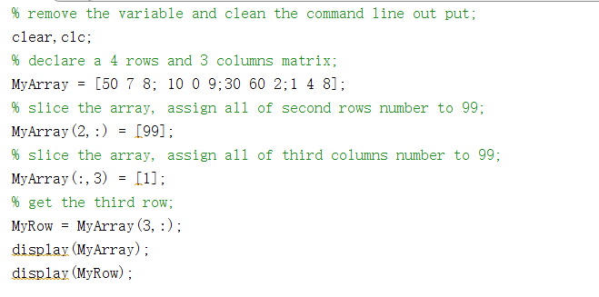
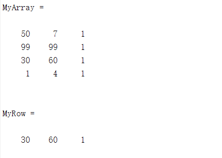
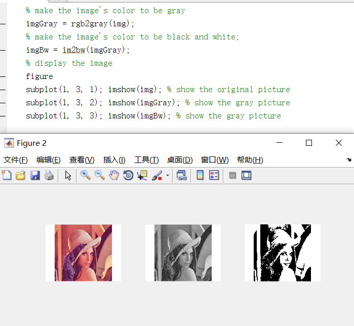
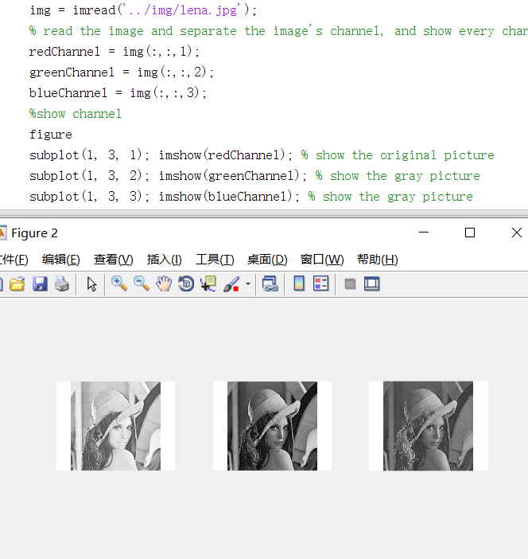
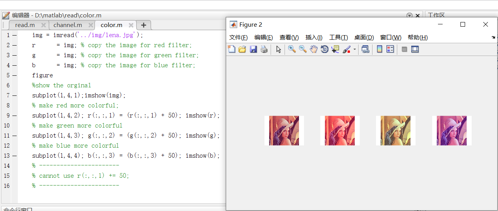
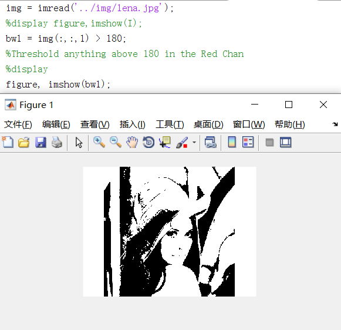
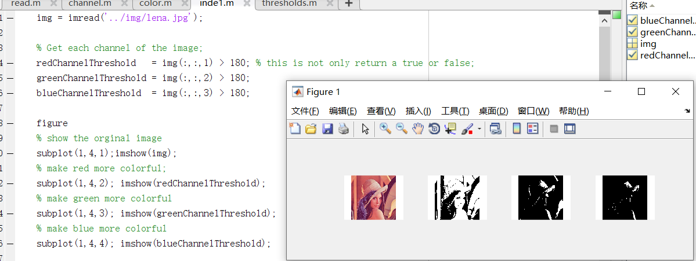
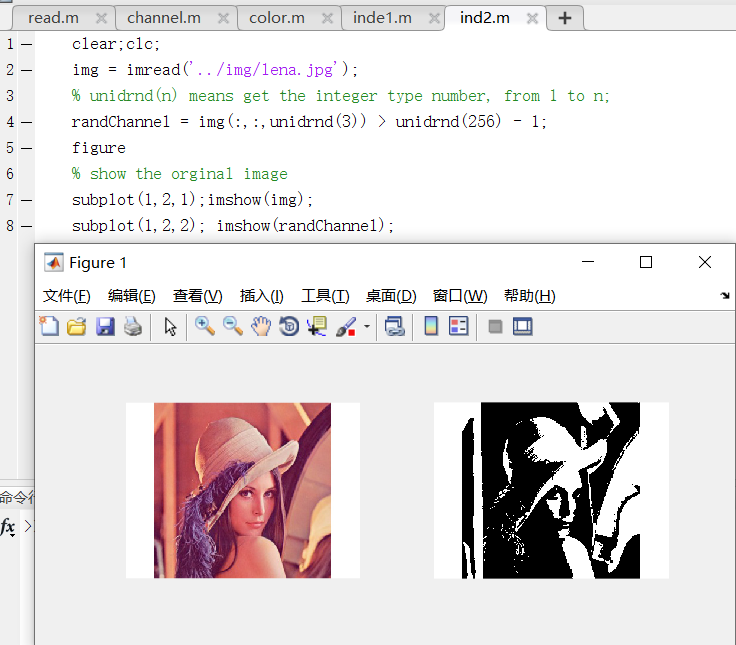

# Matlab Note

### TASK 1: My simple matrix;

### TASK 2: Reading and displaying images.

### TASK 3: Reading and displaying display different channel of images.

### TASK 4: Working on individual colour spaces can allow the manipulation of the image attributes. For example, 

### TASK 5:You can further apply thresholds to image information or logical operations on single colour channels just like you could on the entire image. 

	INDEPENDENT TASK 1:
	• Download an RGB image of your choice 
	• Open the image in Photoshop and check that the image is RGB 
	• Write your own .m file that applies a threshold to each of the Red, Green and Blue channels of the image and displays all the result images and the original image in figure windows. 
	• Download more RGB images and test your .m file • Demonstrate your .m file to a tutor in the session

	INDEPENDENT TASK 2: 
	• Download an RGB image of your choice 
	• Open the image in Photoshop and check that the image is RGB 
	• Write your own .m file that applies a random threshold to a random colour channel 
	• For this you are to search in the help for the “rand” function and try to determine how you can use it
	• Remember that your threshold will need to be in the range 0 to 28 −1 
	• Display your random threshold image in a figure window 
	• Demonstrate your .m file to a tutor

