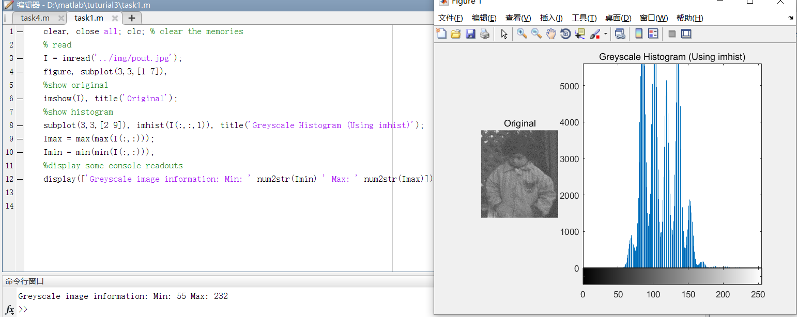
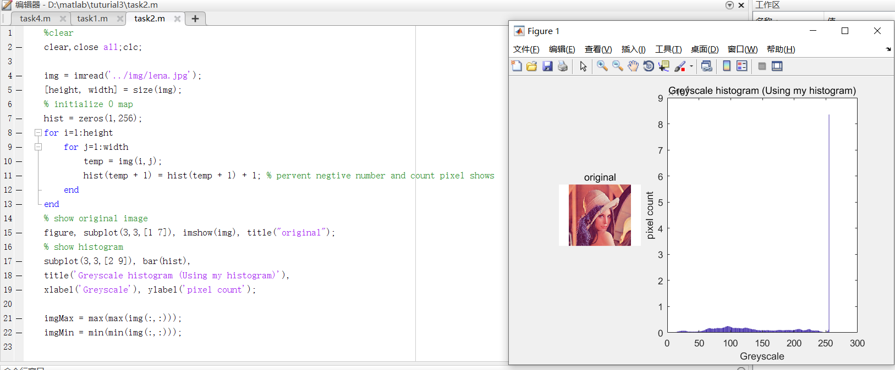
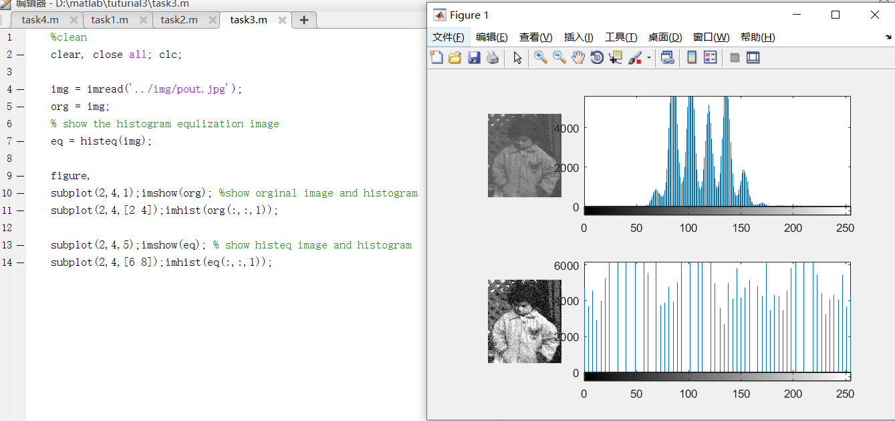
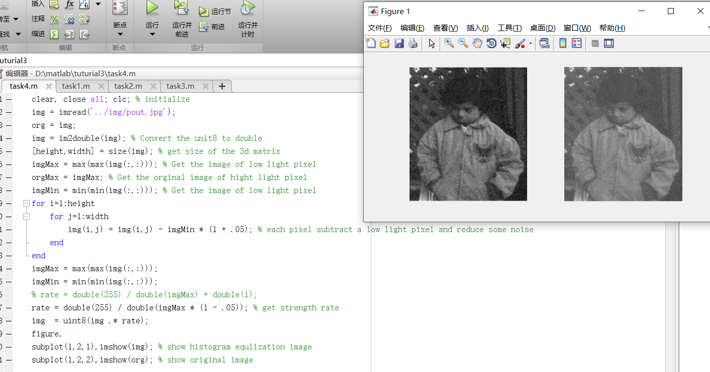

# Matlab Note

### TASK: 1 For the first part of this tutorial you will look to use the “imhist” function in Matlab to create and display a histogram of the pixel information in a grey scale image. Therefore apply the following code and then visualise the histogram as a bar plot:

### TASK: 2 Apply the following code and see how it functions in creating the histogram data. Look at the function of the “MyHist” array and see how its being addressed. You are aiming to replicate the figure shown.

### TASK: 3 Adapt your code from task 2 to plot the histogram of the original input image, then equalise this image using the “histeq” function and the example. You should then plot the equalised image histogram, the original histogram and all image results. You are aiming to replicate the figure below.

### TASK: 4 For this task you are to apply histogram contrast normalisation using the numerical function from the lecture. To help, the theory image from the lecture is given below and also some pseudo code which you need to use as a guide.

