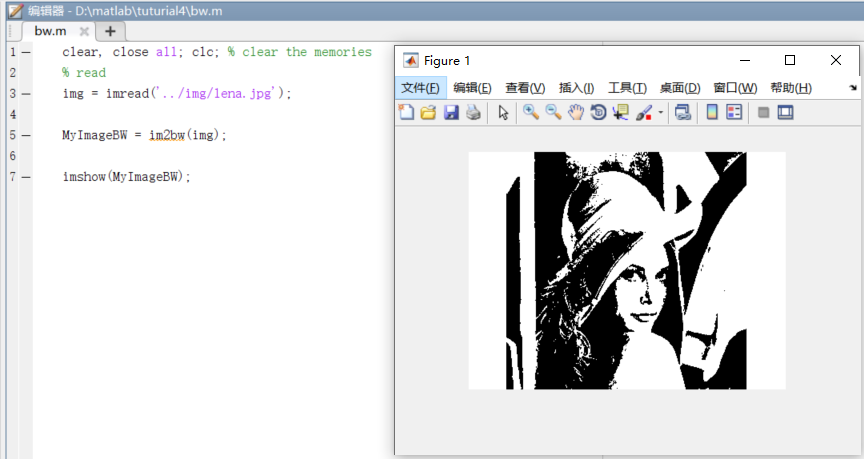
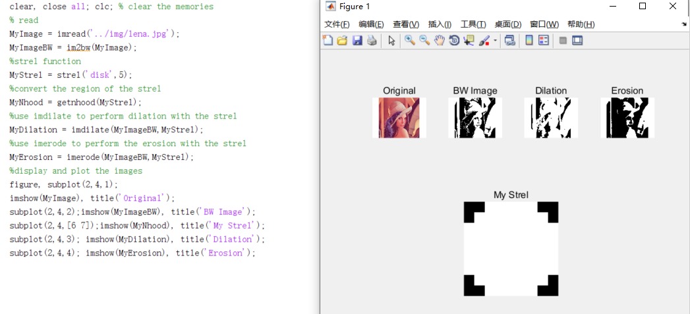

	TASK 1: Using your .m files and functions from the previous tutorial read in the “lena” image, check its dimensions, convert it to greyscale and then convert it to binary. Store this in a variable called “MyImageBW”.

	TASK 2: Using the code below, create an .m file script (or if you feel adventurous a function) that creates a structuring element, applies Dilation and then Erosion using this to this image.

	TASK 3: The example below shows how to use an image called “mystrel.tif” to apply dilation. Create a strel image in Protoshop and apply this code to perform dilation. My example is on the pout image.

