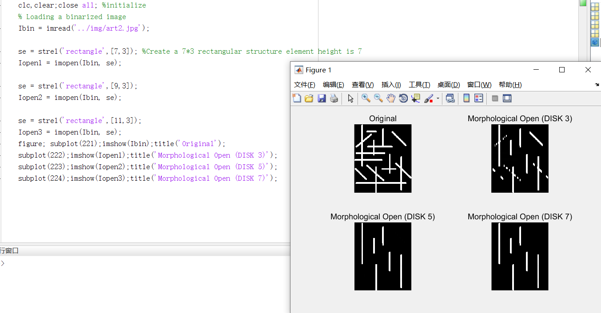

	TASK 1: Given the image (cell.jpg), complete the following operations
	(1) Load the image, use the threshold 210 for binarization (2) use the morphological open operation (open) to process the binarized image, retain the larger cell body (3) try different structural elements (structuring element), the difference in comparison results

	TASK 2: Given the image (art.jpg), complete the following
	(1) Loading the image (2) Using the morphological open operation (open) to process the image, try to delete all the long strips and retain the circular object (3) Try different structuring elements, compare the results difference

	TASK 3: Given the image (art2.jpg), complete the following
	(1) Loading the image (2) Using the morphological open operation (open) to process the image, try to keep only the vertical object. (3) Try different structuring elements, and compare the results.

	TASK 4: Given an image (art2.jpg), how do you keep only horizontal objects?

	TASK 5: Given the image (circle.jpg), complete the following operations
	(1) Loading the binarized image (2) Processing the binarized image using the morphological closing operation (3) Trying different structuring elements to compare the difference

	TASK 6: Given the image (phone.jpg), complete the following
	(1) Load the image, use the threshold value of 100 for binarization (2) Use the morphological closing operation to close the binarized image to get the outline of the phone. (3) Try different construction elements (structuring) Element), the difference in comparison results

