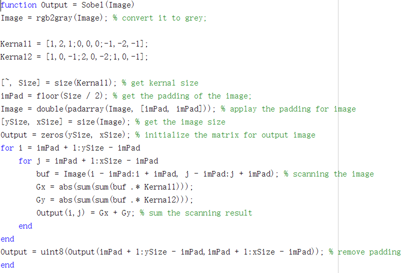
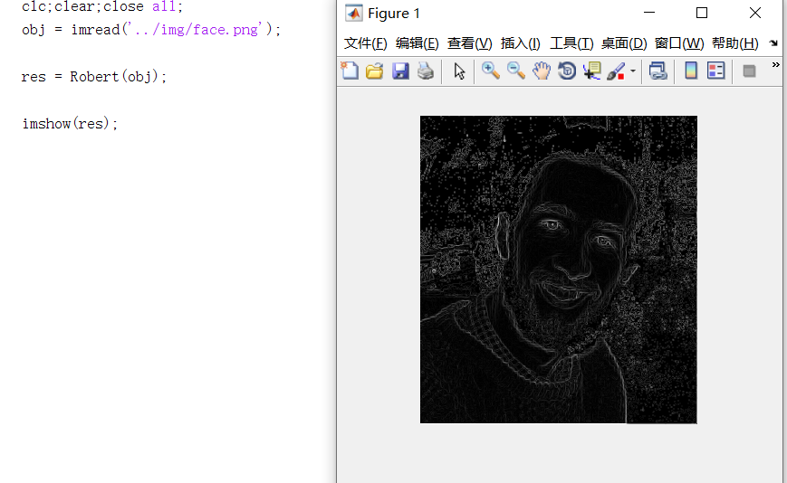

	TASK: 1 For the first task you are to open your 2D spatial filter function “MySpatialFilter.m” and look to change the function of it to allow 2D convolution.

	TASK: 2 Adapt your function to apply laplacian convolution of the image. Note the laplacian convolution kernel is as follows:

	TASK: 3 Adapt your function to allow an argument to be passed to the function to allow the user to specify either the “average“ filter convolution or the “laplacian” filter convolution.

	TASK: 4 Adapt your function to allow an implementation of the following convolutions:

	• Emboss

	• Gaussian low pass 

	• Sobel Edge Detection 

	• Roberts Edge Detection 

