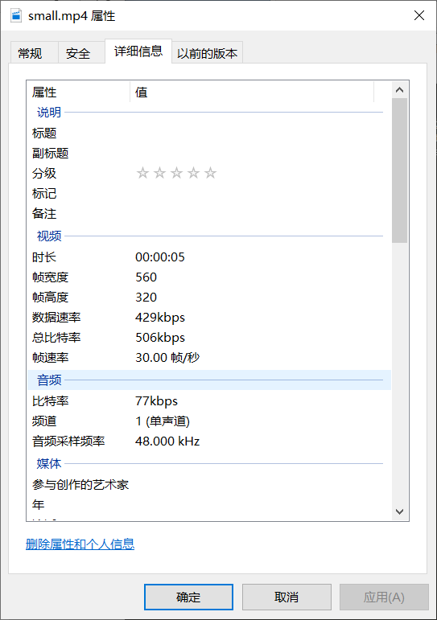
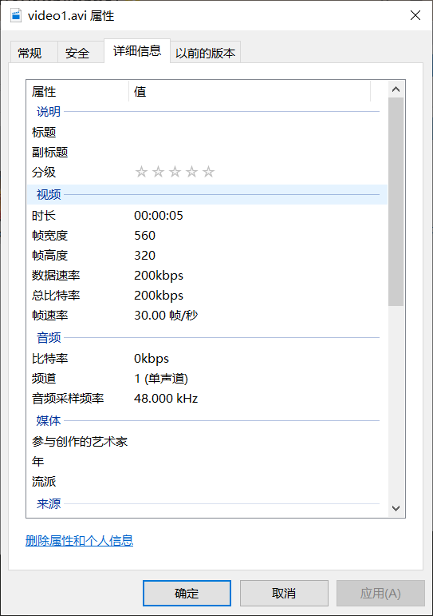
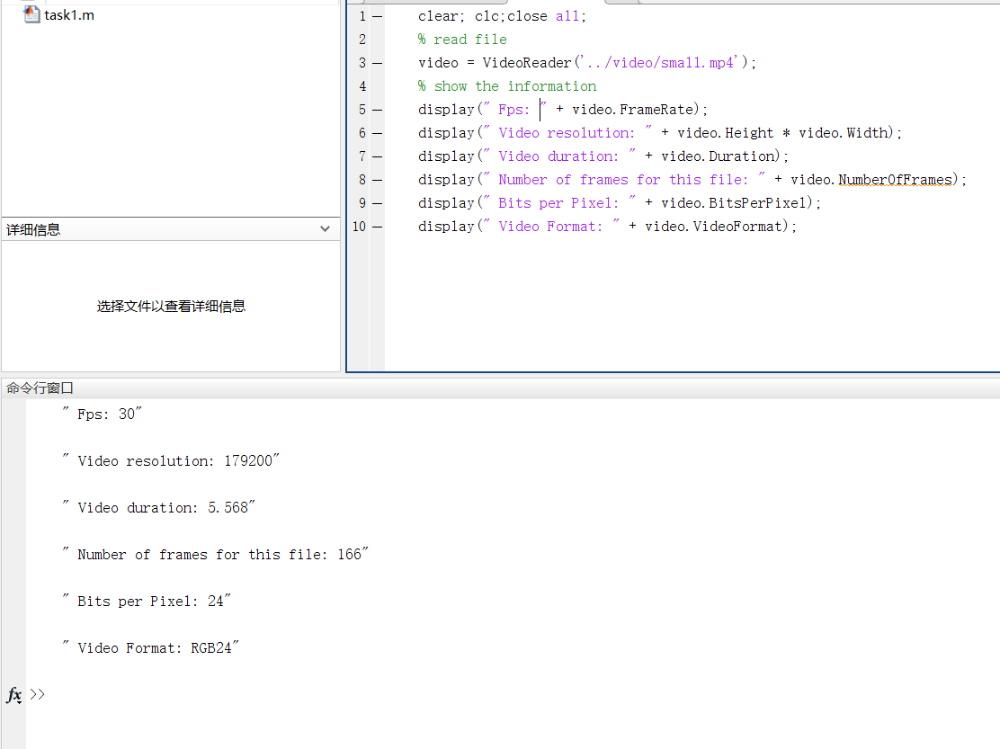
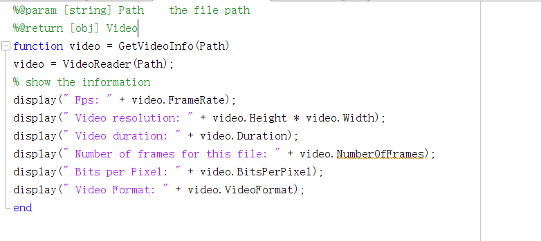
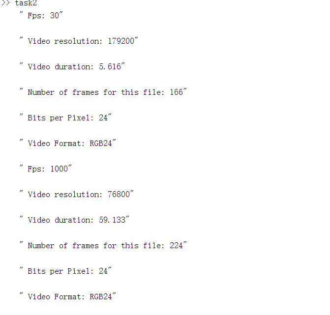

TASK 1: Download ’Video1.avi’ and ’Video2.avi’ from Moodle and use Windows settings (right click > properties > details ) and VLC (tools > Codec Information) to check the video properties (frame-rate, resolution, bitrate, Codec information).

TASK 2: Now in Matlab, explore the use of the VideoReader function in Matlab. Check its properties values. Then write the code to display in the command window the following ones:

TASK 3: Now create a function that prints these video properties in the command window when you pass a video filename as an argument.

Task 4: Display the properties for videos ’Video1.avi’ and ’Video2.avi’. Do you spot any differences? What are these? and why?

the differences is  FPS,resolution,duration,file frames rate. because the file size and duration are different.

Task 5: Using Matlab help documentation, check the VideoReader supported formats. Download your own video file and check its properties using the function in Task 3.

